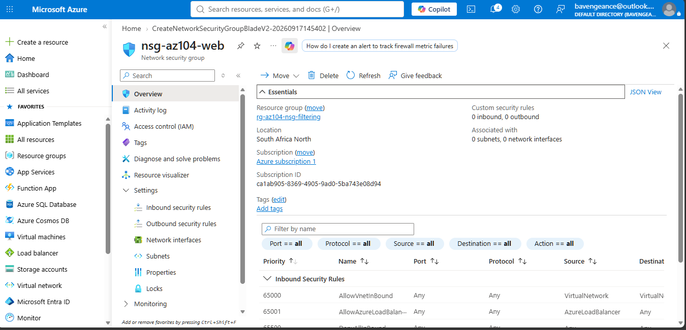
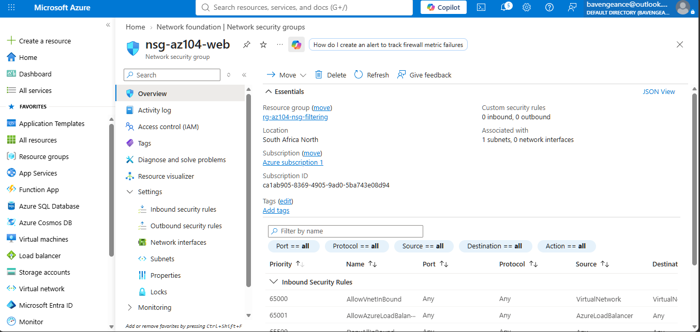
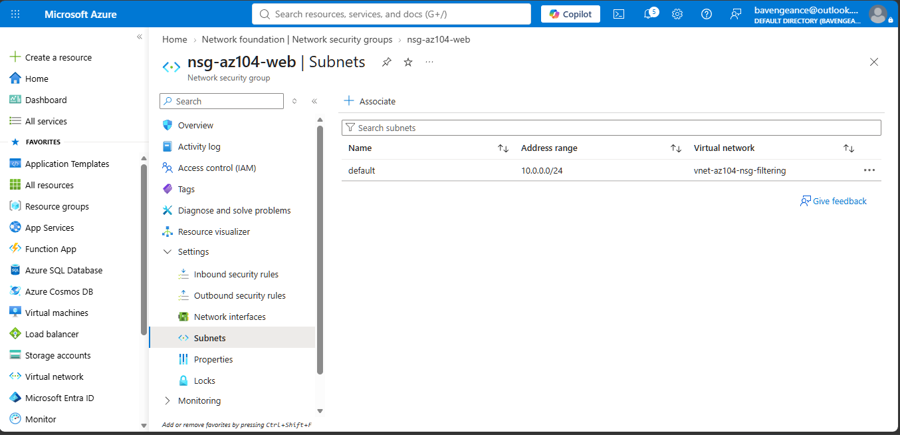
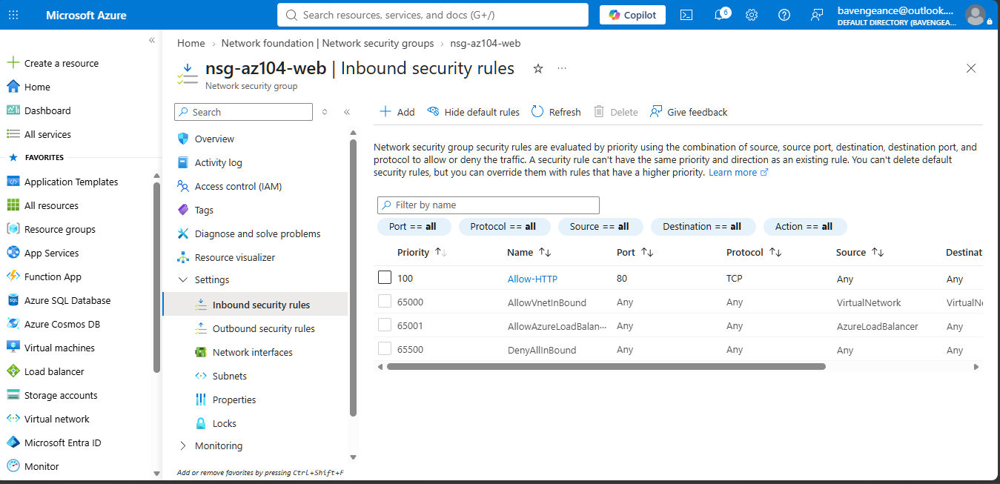
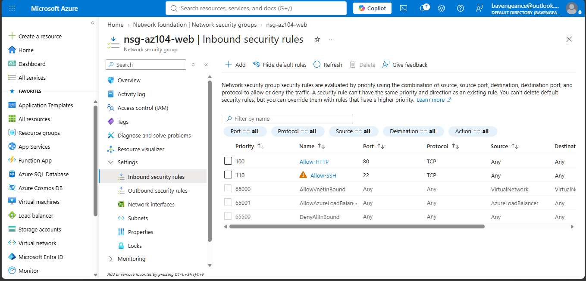
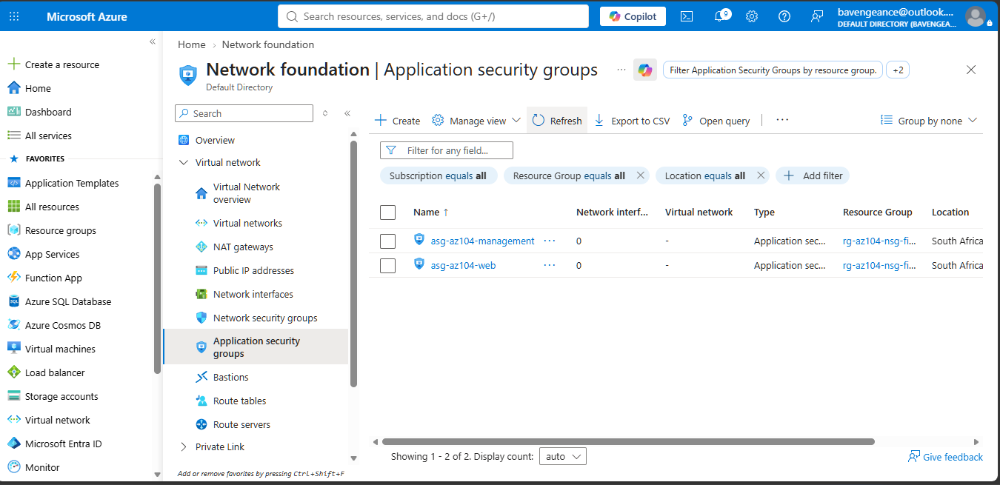
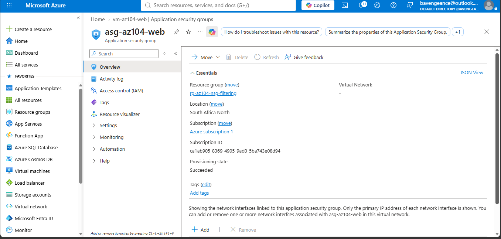
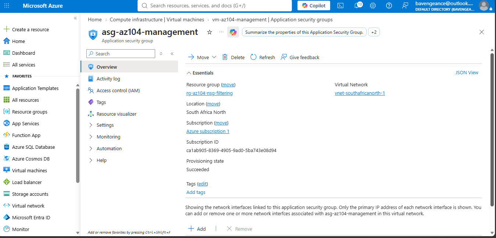
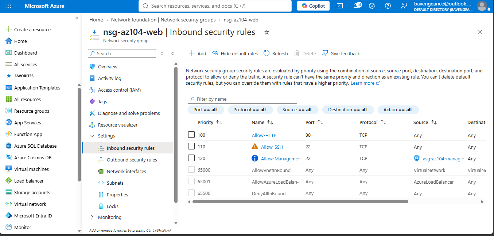
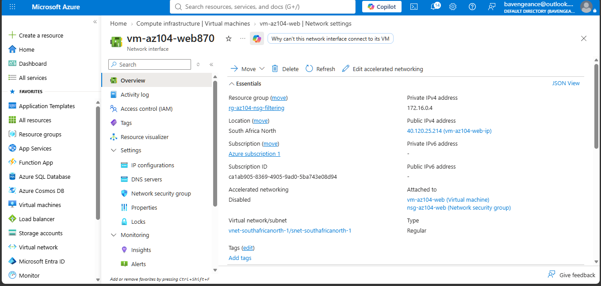

# AZ-104 – Network Traffic Filtering with Network Security Groups

## Project Overview

This project demonstrates the implementation of network traffic filtering in Microsoft Azure using **Network Security Groups (NSGs)** and **Application Security Groups (ASGs)**.

The lab was completed in **South Africa North** and focuses on Azure networking and security administration tasks relevant to the **AZ-104 Azure Administrator** certification.

## Objectives

* Create and configure an Azure Virtual Network
* Configure a subnet for Azure workloads
* Create and associate a Network Security Group
* Configure inbound network security rules
* Create Application Security Groups
* Associate Application Security Groups with VM network interfaces
* Configure traffic filtering using ASGs
* Review the resulting network configuration

## Azure Resources

| Resource                              | Name                      |
| ------------------------------------- | ------------------------- |
| Resource Group                        | `rg-az104-nsg-filtering`  |
| Region                                | South Africa North        |
| Virtual Network                       | `vnet-southafricanorth-1` |
| Subnet                                | `snet-southafricanorth-1` |
| Network Security Group                | `nsg-az104-web`           |
| Web Application Security Group        | `asg-az104-web`           |
| Management Application Security Group | `asg-az104-management`    |
| Web VM                                | `vm-az104-web`            |
| Management VM                         | `vm-az104-management`     |

## Network Security Rules

The NSG was configured with inbound rules to control network traffic.

| Rule                        | Protocol | Port | Action | Priority |
| --------------------------- | -------- | ---: | ------ | -------: |
| Allow-HTTP                  | TCP      |   80 | Allow  |      100 |
| Allow-SSH                   | TCP      |   22 | Allow  |      110 |
| Allow-Management-to-Web-SSH | TCP      |   22 | Allow  |      120 |

The ASG-based rule demonstrates how traffic can be controlled between application groups rather than relying on individual IP addresses.

### Traffic model

```text
Management ASG
      |
      | TCP 22 / SSH
      v
   Web ASG
```

## Architecture

The environment uses Azure networking components to control communication between workloads.

```text
                    Azure Virtual Network
                   vnet-southafricanorth-1
                            |
                     snet-southafricanorth-1
                            |
                    Network Security Group
                       nsg-az104-web
                            |
              +-------------+-------------+
              |                           |
       Management VM                  Web VM
       vm-az104-management            vm-az104-web
              |                           |
       asg-az104-management          asg-az104-web
              |                           |
              +------ TCP 22 ------------+
                         SSH
```

## Implementation

### 1. Virtual Network

Created the Azure networking environment in South Africa North and configured the workload subnet.



### 2. Network Security Group

Created `nsg-az104-web` to control inbound network traffic.



### 3. NSG Subnet Association

Associated the NSG with the workload subnet.



### 4. HTTP Rule

Configured an inbound TCP rule allowing HTTP traffic on port 80.



### 5. Inbound Security Rules

Configured inbound security rules for HTTP and SSH traffic.



### 6. Application Security Groups

Created separate ASGs for web and management workloads.



### 7. Web VM Networking

Associated the web workload with the web Application Security Group.



### 8. Management VM Networking

Configured the management workload and associated it with the management Application Security Group.



### 9. ASG-Based Security Rule

Configured an NSG rule allowing SSH traffic from the management ASG to the web ASG.



### 10. Network Interface and NSG Association

Verified the web VM's network interface and its association with the Network Security Group.



## Skills Demonstrated

* Azure Virtual Networks
* Subnet configuration
* Network Security Groups
* NSG security rules
* Inbound traffic filtering
* Application Security Groups
* VM network interfaces
* Azure networking security
* TCP/UDP port concepts
* Network segmentation
* Azure Portal administration

## AZ-104 Relevance

This project demonstrates practical skills in the Azure networking and security areas covered by the **Microsoft Azure Administrator (AZ-104)** certification.

The lab focuses particularly on:

* Configuring virtual networking
* Managing network security groups
* Implementing network security rules
* Managing VM networking
* Applying application-based network security controls

## Cost Management

The lab was designed as a temporary learning environment.

After completing the required testing and evidence collection, temporary Azure resources should be stopped or deleted to prevent unnecessary ongoing charges.

## Learning Outcome

This lab provided hands-on experience with Azure network traffic filtering and demonstrated how NSGs and ASGs can be combined to control communication between workloads within an Azure virtual network.

The project forms part of my practical Azure Administrator learning portfolio.
